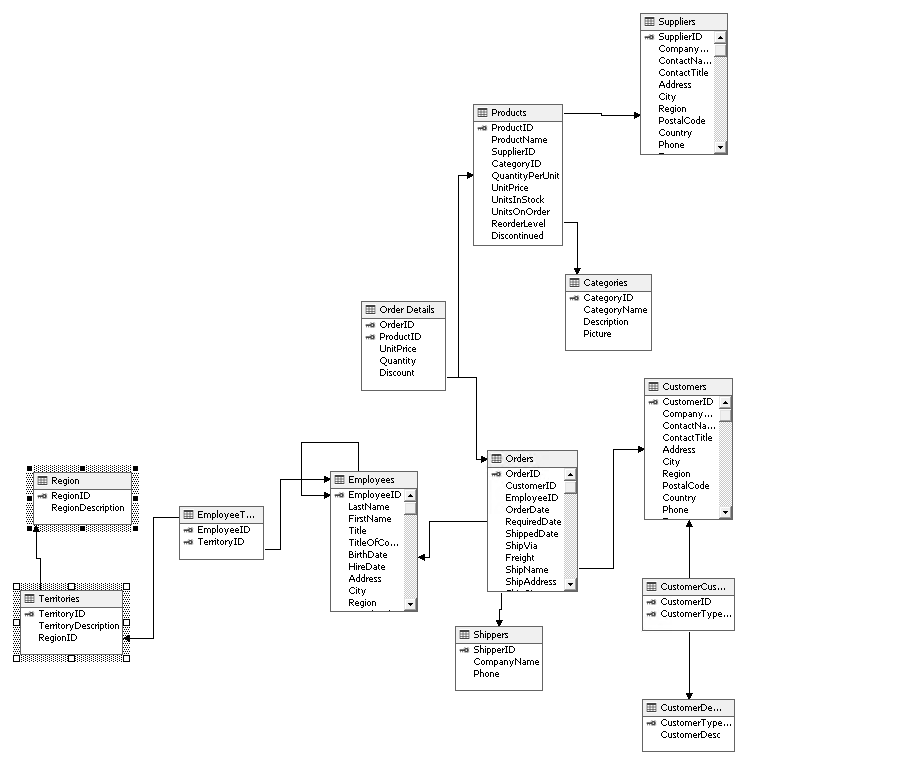

<h1 align="center">Sistemi Informativi Progetto di Laboratorio a.a. 2024/2025</h1>

### Esercizio 1. Progettazione di una DW

Un'etichetta discografica vuole tenere traccia di tutti i contratti stipulati con le band, i dischi che produce e delle vendite di questi dischi. Al momento, l'etichetta conserva solo i dati relativi ai contratti in corso e non conserva alcuna informazione storica. Si decide quindi di costruire un data warehouse per raccogliere e archiviare le informazioni storiche. Con il data warehouse l'azienda vuole analizzare le proprie vendite.  
I dirigenti dell’azienda vi raccontano che quando si decide di finanziare un nuovo disco di una band viene stipulato un contratto. Ogni disco ha il suo contratto, ma lo stesso contratto può applicarsi a più dischi. Per redigere il contratto, la band viene iscritta presso l’etichetta discografica: ogni band ha un nome, una categoria musicale principale e uno o più artisti. 
Eventualmente viene anche specificato il manager del gruppo, ma non è obbligatorio averlo. In questo caso, le band che non hanno un manager indicano uno degli artisti come rappresentante principale. 
Ogni artista è specialista di uno strumento principale, che può essere anche la sua voce. 
È importante notare che, nel corso del tempo, le band possono dividersi, attrarre nuovi membri, o sostituire i membri del gruppo. Questi cambiamenti saranno eventualmente catturati prima della sottoscrizione di un nuovo contratto. 
Le band registrano dischi fissando una o più sessioni di registrazione. I dischi sono poi prodotti e distribuiti dall'etichetta discografica. I dischi, compresi quelli non ancora terminati, hanno un titolo e sono identificati da uno speciale codice internazionale. 
Per ogni disco vengono mantenuti il costo di produzione e la data di uscita. 
Il contratto stipulato tra l’etichetta e la band stabilisce anche quale percentuale di guadagno deve essere assegnata alla band, al manager (se presente) e all’etichetta. 
Una volta prodotto, il disco viene messo in vendita. 
Negozi specializzati vengono contattati da un promoter dell’etichetta discografica che offre il nuovo disco per la vendita, il negozio valuta l’offerta che può accettare, rifiutare o può fare una controfferta. 
Una volta stabilito il prezzo di unitario di acquisto del disco da parte del negozio, il negozio può sottomettere uno o più ordini per un preciso numero di pezzi.  L’etichetta può soddisfare gli ordini consegnando il materiale richiesto o, in caso di carenza, l’ordine viene messo in coda. Ovviamente, lo stesso negozio può emettere più ordini per uno stesso disco e ogni volta il prezzo unitario può essere diverso. 

#### Cosa dovete fare.

- Progettare un modello di dominio in UML che sia in grado di catturare tutti i concetti (e le relazioni tra questi) rilevanti introdotti nella descrizione.
- Progettare in BPMN il processo di acquisto di un disco da parte di un negozio modellando sia le attività dell’etichetta sia quelle del negozio.
- Progettare il DFM di una DW che risponda (almeno) alle seguenti query analitiche:
    - Qual è il disco/gruppo/artista che ha dato all'etichetta discografica il più alto/basso guadagno/rendimento sull'investimento per settimana/mese/anno.
    - Quale negozio/città/paese ha il maggior numero di richieste che non è stato possibile soddisfare?
    - Quale disco/gruppo/artista ha il maggior numero di richieste?
- Definire lo SS della DW progettata al passo predente.

#### Esercizio 2. Uso di una Data Warehouse

Ripristinate in Postgres il database Northwind scaricaribile dalla pagina moodle. 
Lo schema concettuale di questo database è come in figura.

Scrivere in Knime uno o più workflow che, una volta collegati al database postres, rispondano alle seguenti query.
1) Restituire i 5 prodotti che danno il guadagno maggiore calcolato come prezzo unitario per numero di prodotti venduti, tenendo conto che il prezzo unitario potrebbe cambiare nel tempo
2) Calcolare la media mobile su tre trimestri (quello corrente e i due precedenti) delle quantità vendute per ogni singolo prodotto con e senza il paese di vendita (due varianti della stessa query) 
Osservazione, la data letta dal database è un unico campo che deve essere opportunamente separato in anno e mese, Knime mette a disposizione nodi dedicati al tempo. Si consiglia di manipolare il campo data in Knime e produrre una nuova vista sul DB su cui andrete a fare la query.

#### Esercizio 3. Data Mining
Usando Knime, applicare un algoritmo di data mining a scelta ai dati del database Northwind, spiegando perché lo avete scelto (cosa vi permette di scoprire).